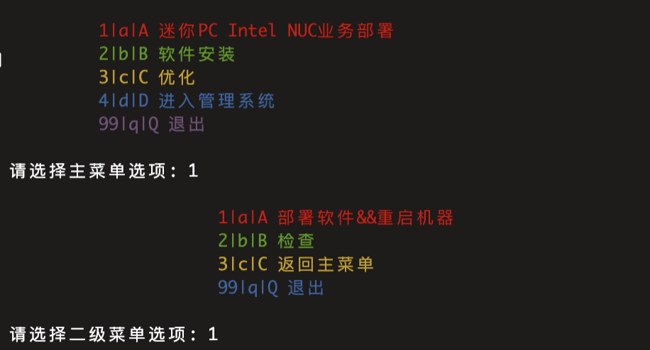
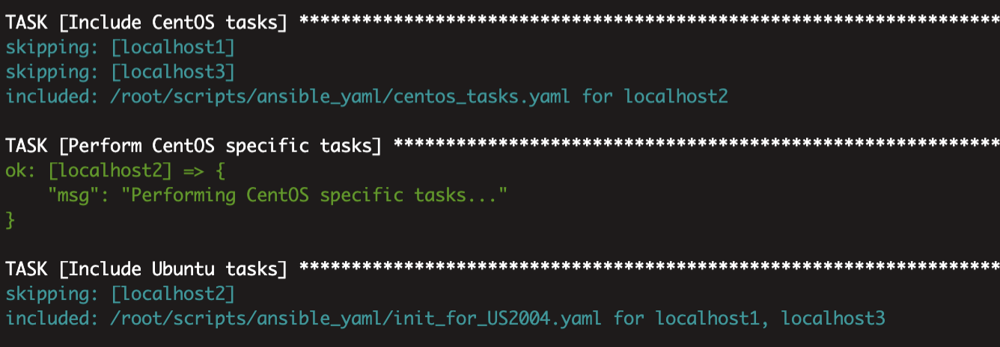

# AutoDeploy360

cobbler+shell+ansible+jinja2

20230516 0.01版本更新

20230517 0.02版本更新（主要更新:
新增:
可以同时使用不同用户，对不同操作系统进行初始化
动态获取hosts.yaml
修复:
了一些bug
）

20230518 0.03版本更新
修复一些bug
新增centos7的初始化

20230519 0.04版本更新
修复bug
继续完善centos7的初始化